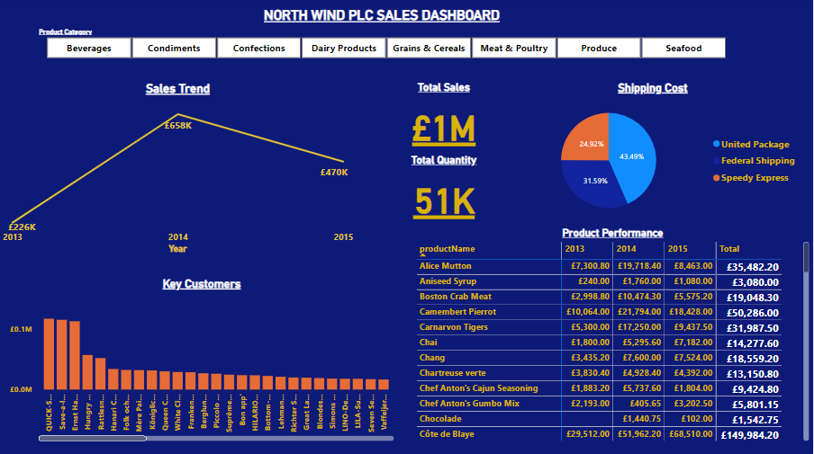
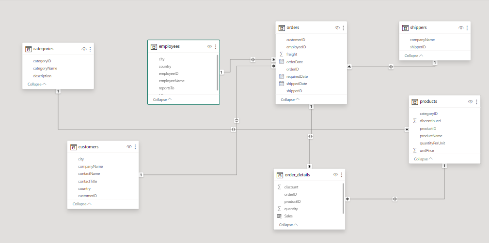
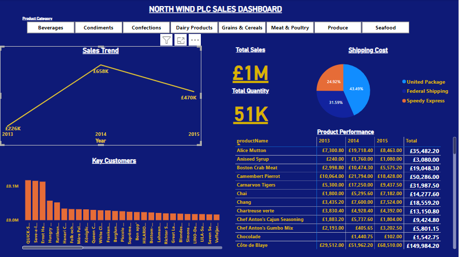
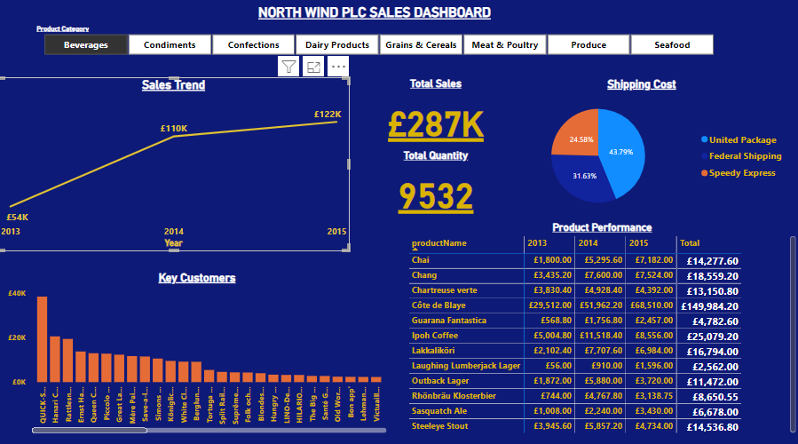
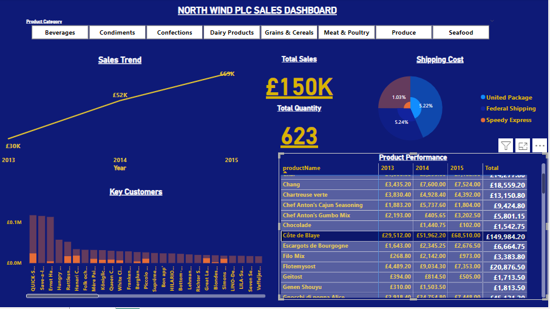

# North Wind PLC Sales Analysis

----
## Introduction
**North Wind plc** is a global import and export company that specializes in supplying high-quality gourmet food products to restaurants, café and speciality food retailers around the world. This project is done using Microsoft Power BI to analyse the sales of the imaginary store. The project is to analyse and derive insights to answer crucial questions and help the store make data-driven decisions.

**_Disclaimer:_** _All datasets were downloaded [here](https://drive.google.com/file/d/1aSxLkZfbxGt_Ua0Pl0WIAVTG6_fuk42B/view?usp=sharing) and do not represent any company, institution, or country, but just to demonstrate the capabilities of Power BI._

**_Objective:_** **_This aims at building a top-level KPI dashboard for the executive team and its purpose is to allow the team to quickly understand the company's performance in key areas._**
--

---
## Problem Statement
1.	What is the North wind sales trend over time?
2.	What are the product key performance of the company?
3.	How can the key customers be identified?
4.	What is the cost to the company regarding shipping of products?
## Skills and Concepts Demonstated
The following Power BI features were incorporated in the analysis:
- Data Cleaning,
- DAX,
- Formatting,
- Modelling,
- Quick Measures,
- Filters.
## Modelling 
Power BI automatically derives relationships, these relationships are adjusted to replace unwanted relationships with the required new relationship below:

---

---
There are dimension tables and fact tables all connected to each other. The dimension tables are all joined to the fact tables with a one-to-many relationship. The model is a **Snow Flake schema**.
## Visualization
The report comprises 6 items:
1.	Sales Trend,
2.	Key Customers,
3.	Product Performance,
4.	Total Sales Amount,
5.	Total Quantity sold and 
6.	Shipping Cost.

You can interact with the report [here](https://demontfortuniversity-my.sharepoint.com/:u:/r/personal/p2778587_my365_dmu_ac_uk/Documents/Northwind%20sales%20Project.pbix?csf=1&web=1&e=lwlewI)
### Features
- There is a product category as a filter on the dashboard, when we click on each category, the affects the overall dashboard report.
- Each filter button such as beverages, condiments, confectionary etc. will give an analysis based on the selected product category.
  
## Analysis

### Sales Trend:
In 2014, North Wind recorded **£658,388.78** highest total sales across all products in the company. Specifically in 2015, about **£122,223.75** highest sales for Beverages when compared to other products.👍

 Total sales            | Sales with beverage category
:-------------------------:|:-------------------------:
|
---
### Total sales and quantity
Across all three years of running the business, the company records has sold about fifty-one thousand pounds worth of goods and records a total sale of a million pounds!

### Product Performance
The product that seems to be doing well across all categories is **Cote de Blaye** which is a Beverage with a total sale of **£149,984.2.** 

--

--

### Key Customers
The key customers of the company for the sake of this report is determined by the customers with the largest sales value, the top 5 customers of the North Wind are **Quick Stop, Save a lot market, Hanari Canes, Hungry Owl All Night Grocers, and Rattlesnakes Canyon Grocery** in ascending order. **Note:** this order changes when using the product category filter.

### Shipping Cost
North Wind ships products to customers from three major shipping companies;
1.	United Package
2.	Federal shipping
3.	Speedy express.
According to the analysis, United package shipping company is associated with the highest cost across all products by **43.49%.**

## Conclusions and Recomendations

North Wind recorded the **highest sales in 2014**, although this changes across all different products. In order to ensure the top revenue, each product can be studied using the dashboard to produce future sales predictions.

The company should invest more in the supply of **Cote de Blaye**, it seems to be a favourite wine brand!🙂

**Quick Stop** is the Top customer of the company for all products, a customer reward or benefit program can be organised for the top 5 or top 2 customers depending on the company policies.

## THANK YOU FOR READING!👍💰😄.

